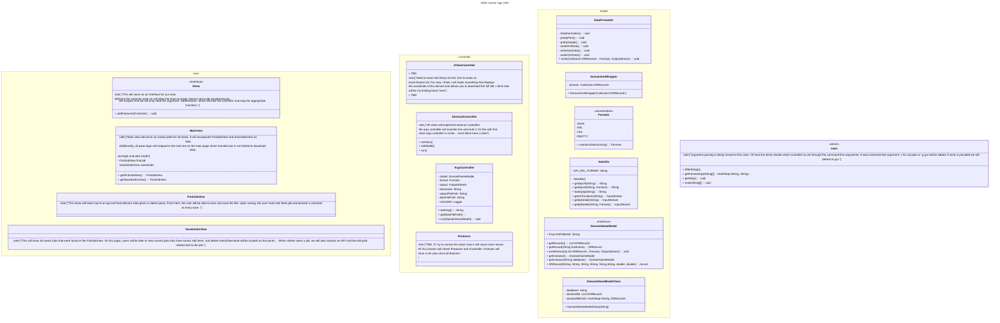

# Skillz Hunter App Desing

The Diagram below outlines the general structure of the Skillz Hunter App.

```mermaid
---
title: Skillz Hunter App UML
---
classDiagram

%% Driver


%% Controller


%% view


%% model


class main{
<<driver>>
note ["argument parsing is being moved to this class. I'll have the driver decide which controller to use through the command line arguments. A new command line argument -c for console or -g gui will be added. if none is provided we will default to gui."]
+ DNInfoApp()
+ getParsedArgs(String[]):HashMap~String, String~
+ getHelp(): void
+ main(String[]): void
}


namespace view {
class IView {
<<Interface>>
note ["This will serve as an Interface for our view. 
Defining this correctly early on will allow the team to easily interact and code simultaneously.
We suspect that we will only need the argument `addFeatures` which will take the controller and map the appropriate functions."]
+ addFeatures(IControler): void

}


class MainView {
note ["Main view will serve as a base plate for all views. It will incorporate FindJobView and SaveJobsView as tabs. 
Additionally, all pane logic will mapped to the task bar on the main page which includes but is not limited to download data, 
and light and dark mode"]

- FindJobView findJob
- SavedJobsView savedJobs

+ getFindJobView() : FindJobView
+ getSavedJobsView() : FindJobView
}


class FindJobView {
note ["This show will reach out to an api and find relevant Jobs given a clients query. From here, the user will be able to view and save the like. Upon saving, the user must rate there job and provide a comment at every save. "]

}


class SavedJobsView {
note ["This will show all saved Jobs that were found in the FindJobView. On this page, users will be able to view current jobs they have saved, edit them, and delete them (Download will be located on the pane). When clients views a job, we will also conduct an API call that will grab related skill to the job."]
}
}


namespace Controller {
class JViewController {
+ TBD
}
class AbstractController {
note ["All views will implement abstract controller.
the args controller will override this and stub it. Im fine with this
since args controller is niche... most items have a view"]
+ setView()
+ setModel()
+ run()
}
class ArgsController {
- model: DomainNameModel
- format: Formats
- output: OutputStream
- hostname: String
- outputFilePath: String
- dataFilePath: String
- LOGGER: Logger
%% - setParsed(String[]): void
+ toString(): String
+ getDataFilePath():
+ run(DomainNameModel): void
}

class IFeatures {
note ["TBD, If I try to narrow this down now it will cause more issues.
All Gui classes will inherit IFeatures and IController. Features will
have a set view since all features "
    ]
}

class JViewController {
note ["Need to learn the library for this GUI to make an
exact feature list. For now, I think I will make something that displays
the coordinate of the domain and allows you to download the full DB. I think time
will be my limiting factor here"]
+ TBD

}

}

namespace model {

class DataFormatter {
- DataFormatter(): void
- prettyPrint():  void
- prettySingle(): void
- writeXmlData(): void
- writeJsonData(): void
- writeCSVData(): void
+ write(Collection~DNRecord~ , Formats, OutputStream) : void
}
class DomainXmlWrapper {
- domain: Collection~DNRecord~ 
+ DomainXmlWrapper(Collection~DNRecord~)
}
class Formats {
<<enumeration>>
JSON
XML
CSV
PRETTY
+ containsValues(string): Formats
}

class NetUtils {
- API_URL_FORMAT: String
- NetUtils()
+ getApiUrl(String): String
+ getApiUrl(String, Formats): String
+ lookUpIp(String): String
+ getUrlContents(String): InputStream
+ getIpDetails(String): InputStream
+ getIpDetails(String, Formats): InputStream
}

class DomainNameModel{
<<Interface>>
+ Final DATABASE: String
+ getRecords(): List~DNRecord~
+ getRecord(String hostname): DNRecord
+ writeRecords(List~DNRecord~, Formats, OutputStream): void
+ getInstance(): DomainNameModel
+ getInstance(String database): DomainNameModel
+ DNRecord(String, String, String, String, String,String, double, double): record
}

class DomainNameModelClass{
- database: string
- domainDB: List~DNRecord~
- domainDBHash:  HashMap~String, DNRecord~
+ DomainNameModelClass(String)
}

}
```
