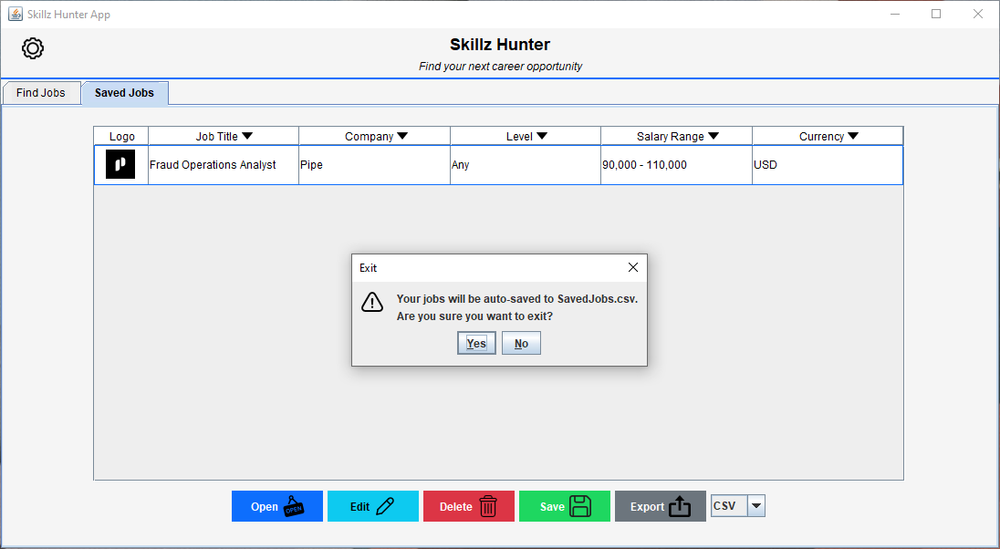

# Jobz Hunter GUI Test Images

## 1. MainView

### Main Operation

### Custom Menu Bar

### Menu Bar - Exit Dialogue

### Menu Bar - Dark Mode

*Also demonstrates: ColorTheme, FindJobTab, IconLoader, SalaryVisualizationPanel, TabStyleManager, ThemedButton*

## 2. Custom Header

### Dynamic Column Headers

## 3. Find Job Tab

### Industry Combobox

### Location Combobox

### Results Combobox

### Salary Visualization Panel

### Search Correction

### Query Does Not Exist

### Job Selection

## 4. Job Details Dialogue

### Star Panel and Comment Text Area:

### Successful Save Dialogue

## 5. Saved Job Details Dialogue

### Dynamic Edit Dialogue (if already saved)

### Failed Save Dialogue (if already saved)

## 6. Saved Jobs Tab

### No Jobs Selected Dialogue

### Save Jobs to File Dialogue

### Successful Save Jobs to File Dialogue

### Delete from Saved List Dialogue:

### Successfully Deleted Job Dialogue:

### Export to File Dialogue

### Export Location File Selection Dialogue:

### Successfully Exported to File Dialogue:

### Export File:

### Exit Automatically Saves to Database:

### Saved Jobs Loads With New Job From Database:
