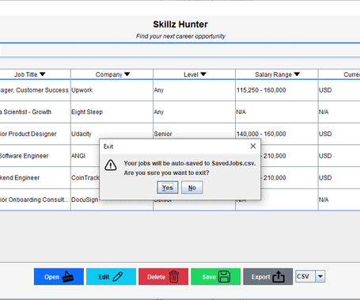

# Final Project for CS 5004 - Skillz Hunter
# Skillz Hunter

## Job Search and Management Application

Skillz Hunter is a desktop application designed to help users find and manage job opportunities. The application allows users to search for jobs across various industries and locations, save jobs for future reference, rate jobs, add comments, and export saved jobs in multiple formats.

## Group Members and GitHub Links

* Eleah Burman - https://github.com/EleahBurman
* Joshua Roberge - https://github.com/jroberge16
* Judson Tallandier - https://github.com/iamjtii
* Tor Ekstrom - https://github.com/tekstrom11

## View My App

* View of full CRUD operations

## Features
* **Search Jobs**: Find jobs by title, industry, and location and gives suggestions for searches based on key words
* * **Query Suggestions**: The application incorporates Natural Language Processing techniques for search queries, including:
  * Levenshtein distance algorithm to detect and correct typos in search terms
  * Query suggestion system that learns from successful searches
  * Special case handling for missing or incorrect characters
  * Priority-based suggestion system that considers both common industry terms and user's recent successful queries

* **View Job Details**: See comprehensive information about each job including salary ranges using an API
* **Save Jobs**: Store jobs you're interested in for later reference
* **Sort Jobs**: Sort jobs by name and amount
* **Rate and Comment**: Add personal ratings and comments to saved jobs
* **Salary Visualization**: View a graphical representation of salary ranges
* **Export Capabilities**: Export saved jobs in CSV, JSON, or XML formats
* **Theme Support**: Toggle between light and dark themes for user preference
* **Cross-Platform**: Works on Windows, macOS, and Linux systems

## Application Architecture

Skillz Hunter follows the Model-View-Controller (MVC) architectural pattern:

* **Model**: Manages job data and business logic and connects to API
* **View**: Handles UI components and user interaction
* **Controller**: Coordinates between Model and View

## Design Documents

The application design documentation is available at:
[Skillz Hunter Design Mural](https://app.mural.co/t/groupproblems2087/m/groupproblems2087/1742423271814/5fb4f317643ee8030903040824290d9a37dc10c5)
The final design UML can be found:
[Mermaid UML](/DesignDocuments/README.md)

## User Manual

The user manual is available in the project directory at:
[User Manual](/manual/README.md)

## Requirements

* Java 17 or higher
* Internet connection for job searching

## Installation and Running the Application

### Option 1: Run from VSCode

1. Clone the repository:
    - https://github.com/Sp25-CS5004-Online-Lionelle/final-project-group-2/
2. Open the project folder in Visual Studio Code.
3. Open the file:
    - src/skillzhunter/SkillsHunterApp.java
4. Click the Run button in the top right corner of the editor or right-click the file and select "Run Java".
5. Make sure the Java extension is installed and your Java environment is properly set up in VSCode.

### Option 2: Build and Run from Source

1. Clone the repository: 
    - https://github.com/Sp25-CS5004-Online-Lionelle/final-project-group-2/
2. Navigate to the project directory:
    - cd skillzhunter
3. Compile the project:
    - javac -d bin src/skillzhunter/*.java
4. Build with Gradle:
    - gradle clean build
5. Run the application:
    - java -cp bin skillzhunter.SkillsHunterApp

## Key Implementation Details

* **Theme Management**: The application supports both light and dark themes with consistent styling across all components. The light theme uses Bootstrap 5 colors with Spotify green accents, while the dark theme uses a teal-based color scheme.
* **Custom UI Components**: Various custom components enhance the user experience, such as star ratings, salary visualizations, and themed buttons.
* **Dynamic Sizing**: Dialogs automatically adjust their size based on content length for optimal readability.
* **Asynchronous Image Loading**: Company logos are loaded asynchronously to keep the UI responsive.
* **Platform-Specific Styling**: The application adjusts certain UI elements based on the operating system to maintain a native look and feel.

## Acknowledgments

* CS 5004 Professor Albert and the TAs Esther and Estelita for their guidance and support
* Bootstrap for color theme inspiration